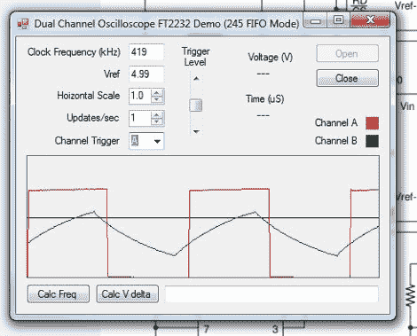

# 用一块 FTDI 板和几个 ADC 制作一个简单的 O 型示波器

> 原文：<https://hackaday.com/2012/01/22/make-a-simple-o-scope-with-a-ftdi-board-and-a-couple-of-adcs/>

[RandomTask]发布了一个很好的教程，介绍如何使用一个 [FTDI 串行到 usb 转换器和几个模数转换器来制作一个简单的软件示波器](http://www.100randomtasks.com/usb-to-serial-converter-samples/ft2232-to-adc0820-adc-demo)。他使用“通用串行到 USB 转换器”和许多 FTDI 分线板中的一个，首先使用 FTDI 的编程软件对芯片进行重新编程，将设备置于 FIFO(先进先出)模式。

从那里连接一对 ADC0820 8 位数模转换器，输入馈入一对 555 进行测试。需要注意的是，它没有输入保护，因此这种设置绝对不允许电压高于 5v 或负电压。在使用微控制器或其他数字电路时，它仍然非常方便。

然后，数据被发送到计算机，并使用 VB.net 程序显示，该程序具有一些基本功能，如缩放和触发，但也包含一些额外功能，如 Calc Freq 和 Calc V delta 计算。

许多人都有这些小的串行到 usb 转换器，可能需要一个简单的范围。如果你是他们中的一员，那么你可以很快很便宜地把它拼凑起来。