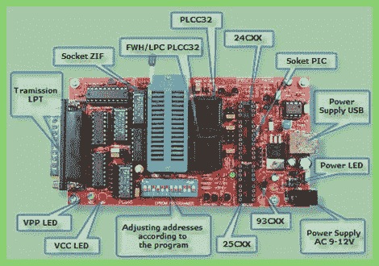

# 让 W7 64 位与你的程序员玩得更好

> 原文：<https://hackaday.com/2011/08/10/make-w7-64-bit-play-nice-with-your-programmer/>

外部 EPROM 刻录机是非常方便的小工具。他们显然可以读写 EPROMS，但通常他们也会处理一堆 PIC，一些 AVR，以及其他可编程逻辑，如 PAL/GAL 和 CLPD。虽然你经常可以找到便宜的(或者免费的)旧型号，但是有几个问题需要解决。

一般来说，你要为一首歌和一个舞蹈得到的模型是旧的并行端口模型，使用 MS-DOS 或 Windows 中的软件，从那以后就没有更新过。该软件通常像使用 1 字节宽的 GPIO 线一样对端口进行位碰撞，这是一个常见的技巧，在当前的操作系统中已经默认消失了。

[Doug]试图在 Windows 7 X64 上使用这些小工具中的一个来找到解决[的方法，并使用了大量的 Google-fu，浏览了一些库，并做了一点代码修改，他只是让他的 Sivava Willem EPROM 程序员在一个漂亮的新 i7 上像冠军一样工作，该 i7 带有并行端口插卡。](http://www.downtowndougbrown.com/2010/10/sivava-willem-eprom-programmer-on-windows-7-64-bit/)