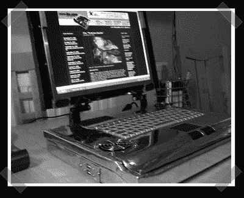

# 制作自己的笔记本电脑

> 原文：<https://hackaday.com/2007/01/20/make-your-own-laptop/>

【理查德】指出这款 [mini-itx 笔记本](http://www.mini-itx.com/projects/itx%2Dlaptop/)。这种特殊设计背后的想法是根据需要升级每个组件。外壳是铝制的，里面的线路是对耐心的考验。这不是我们见过的第一台 DIY 笔记本电脑，也没有电池，但这是我见过的第一台内置两个硬盘的。

更新:有一个电池，它只是很少被提及。它藏在 DVD 驱动器和一个硬盘下面。有人知道是哪种吗？

*   [永久链接](http://www.mini-itx.com/projects/itx%2Dlaptop/)