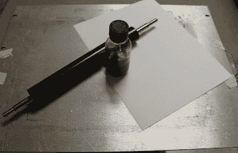

# 制作自己的墨粉转印纸

> 原文：<https://hackaday.com/2010/07/12/make-your-own-toner-transfer-paper/>

谁能想到[一些玉米淀粉](http://sites.google.com/site/matthewsager/home/projects/electronicsshop/tonertransferpaper)能做成[色粉转印纸](http://hackaday.com/2010/05/07/toner-transfer-explained-step-by-step/)？我们不能肯定它的优点(也许它更便宜？)，但是如果你有很多时间或者只是喜欢粘粘的话【Matthew Sager】展示了制作纸张，印刷，然后蚀刻 PCB 的正确方法。

如果你刚刚开始制作印刷电路板，我们建议你看看这些 [DIY 电路蚀刻视频](http://hackaday.com/2009/11/09/diy-circuit-etching-video-tutorial/)以更好地掌握印刷和蚀刻步骤。