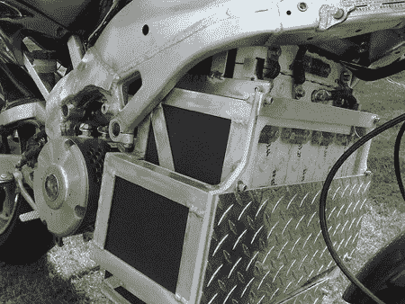
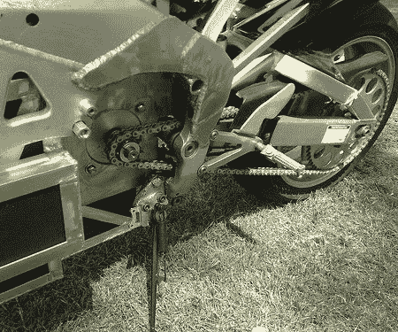

# 2008 年制造商博览会:电动摩托车

> 原文：<https://hackaday.com/2008/05/07/maker-faire-2008-electric-motorcycles/>

上周末，建筑商贾斯汀·格雷(Justin Gray)带了一对电动摩托车参加 Maker Faire。上图是 [R84](http://graywrxfabblog.blogspot.com/2008/03/r84.html) ，它有 28 个 LiFePo 电池和一个提供 54 马力的 84v 交流感应驱动器。所有这些都装在一个 2000 年的雅马哈 R1 相框里。现在花 14000 美元就能买到。

第二辆自行车被称为 [R144](http://graywrxfabblog.blogspot.com/2008/03/r144-dc-super-bike.html) 。这是一个 144 伏的 DC 系统，由 48 节锂电池供电，驱动一个 60 千瓦的串联电机。
 
【贾斯汀】的另一个爱好是建造消防机器人，如下图所示[利比](http://graywrxfabblog.blogspot.com/2007/07/robot-libby.html)。
