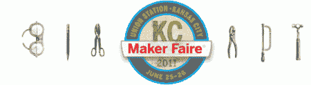
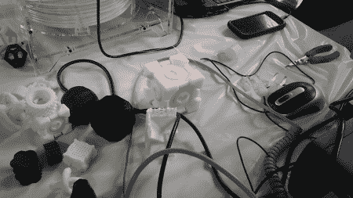
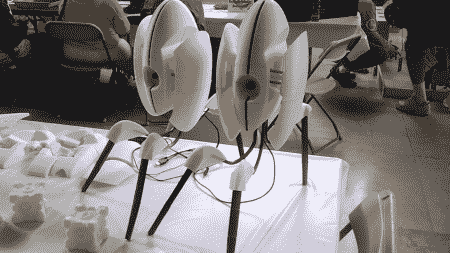
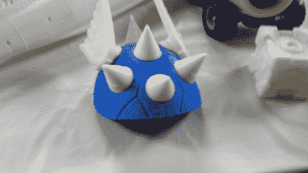
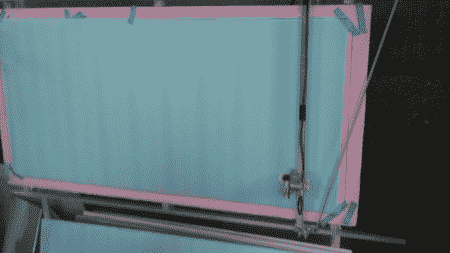
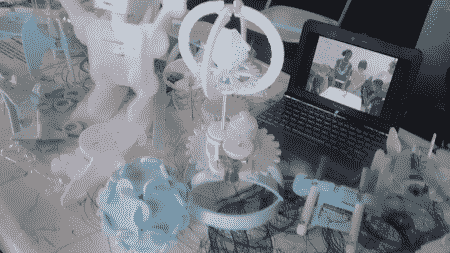
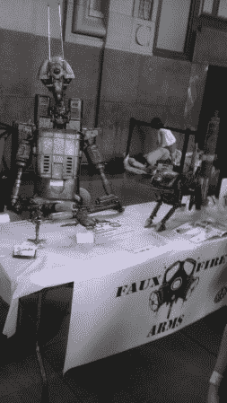
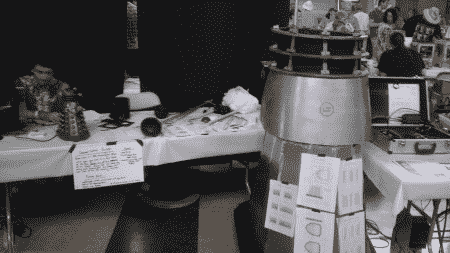

# 2011 年 KC 制造商博览会:照片(第一部分)

> 原文：<https://hackaday.com/2011/06/27/maker-faire-kc-2011-in-photos-part-1/>

作为 Hackaday 的一名作家，我几乎每天都能看到数控机床、原型机、特斯拉线圈等等。然而，有数不清的人通常无法分享这些技术奇迹。Maker Faires 为公众提供了一个机会，让他们看到那些把我们在 Hackaday 上所写的东西组合在一起的发明、杂牌和天才，并与之互动。

休息后跟着我拍一些我看到和喜欢的有趣事物的照片。

我遇到了数不清的 Makerbots、RepRaps 和自制快速原型。这些总是很受欢迎，因为许多人以前从未见过这样的东西。

 只是周围众多原型之一

 同伴立方体到处都是，这一个绝对是最好的之一。

正如看到的部分，以及完全组装，这些门户炮塔绝对令人印象深刻。

 这款红色马里奥赛车外壳由标准的白色和红色原型材料制成

 同主题的另一款遥控汽车

**双轴泡沫切割机:**这款双轴泡沫切割机比大多数 CNC 机器简单得多，它负责不间断地切割出许多小型电动和非电动雕塑。

 双轴泡沫切割机

 泡沫雕塑

书呆子艺术:本质上不一定是技术性的，但有人造机器人、蒸汽朋克服装和更多可看的东西。除了闪烁的灯光之外，他们很少有什么更具技术性的东西，对这些作品的爱和关怀显而易见。

 机器人和达雷克斯琳琅满目，甚至计划自己制作。

这些只是即将看到的奇观中的一部分，请务必关注第二部分，以 3D 形式展示老的最爱 ArcAttack！