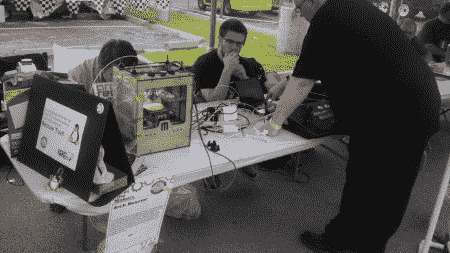

# 2011 年 KC 制造商博览会:照片(第二部分)

> 原文：<https://hackaday.com/2011/06/29/maker-faire-kc-2011-in-photos-part-2/>

一定要看看 KC Maker Faire 照片系列的第 1 部分。在本帖中，我们探索了该节目的一些大人物，包括大众喜爱的 ArcAttack，以及战斗机器人。继续读下去，看看奇迹吧！

**ArcAttack！:**我们已经看到[这些来自德克萨斯奥斯丁的](http://www.arcattack.com/)在过去的[和](http://hackaday.com/2008/06/12/singing-tesla-coils/)中，他们似乎从来不会让人失望。这一次，他们把无辜的受害者志愿者放进法拉第笼，用他们的音乐特斯拉线圈唱歌。该视频甚至是可选的 3D 版本，适合那些戴着眼镜坐在周围的观众。

[https://www.youtube.com/embed/9bnExBuwjTo?version=3&rel=1&showsearch=0&showinfo=1&iv_load_policy=1&fs=1&hl=en-US&autohide=2&wmode=transparent](https://www.youtube.com/embed/9bnExBuwjTo?version=3&rel=1&showsearch=0&showinfo=1&iv_load_policy=1&fs=1&hl=en-US&autohide=2&wmode=transparent)

机械战:许多人在展示他们的[机械战](http://mech-warfare.com/)机器人。这些机器人被远程控制，仅使用安装在船上的摄像机进行驾驶。他们装备了气枪武器，光看着就令人惊叹。

 虽然大部分都是两足步行者，但这是为数不多的四足战士

 对方指望着武者之一

 展示因被气枪击中而留下的伤痕

黑客空间:至少有两个黑客空间出现在创客大会上。堪萨斯城自己的 [Cowtown 计算机大会](http://blog.cowtowncomputercongress.org/)，以及圣路易斯的 [Arch 反应堆](http://archreactor.org/)。这两个组织都在 Hackaday 上受到了关注，看到他们公开展示项目并教育公众是一件好事。

Cowtown 展示了许多基于 Arduino 和 LED 的项目，并分发了 Ubuntu 和 Project Gutenberg 的 CD 和 DVD

 展示 Makerbot，也是少数几个在户外冒险的团体之一

**杂项:**有些项目只是没有很好地归类，但仍然值得炫耀。****

MindDrive ，一个为危险儿童服务的非营利组织正在展示他们的高效汽车原型

 一[鲁本的管子](http://www.youtube.com/watch?v=HpovwbPGEoo)要走了，大厅里没有被点燃，但我们确信它完全正常工作。

在堪萨斯城创客大会上，还有无数其他项目可以看、触摸和聆听。度过周末的好方法，我等不及明年见到你们了。

-[詹姆斯]