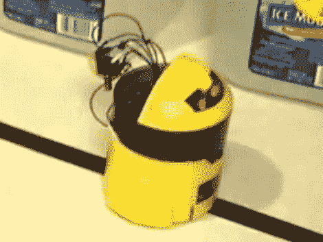

# 将循线玩具变成可编程机器人

> 原文：<https://hackaday.com/2011/08/31/making-a-line-following-toy-into-a-programmable-robot/>

[埃里克·格雷戈里]拿起这个黄色的小机器人作为一个工具箱。它内部有一个单一的 PCB，有一对红外发射器和探测器指向机器人前面的下方。根据红外光束反射回探测器的方式，它能够跟踪亮表面上的暗线。但这是一匹只会一招的小马，埃里克想把它变成一个可编程的机器人。

该工具包带有一个原理图，这使得修补其逻辑的过程非常容易。有两个电机，每个电机都有一个由一对晶体管和一个反激二极管组成的驱动电路。这意味着电机只能在一个方向上移动，但它们也只需要一个逻辑连接来控制。[Eric]没有填充通常将红外接收器连接到电机驱动器的晶体管，而是将跳线从每个芯片焊接到 MSP430 芯片(他的 Launchpad 附带的 G2231)。

正如你在休息后的片段中看到的，他写的第一个版本的代码让机器人沿着一条线走，就像它没有被改变一样。但是仍然有足够的编程空间和几个免费的 I/O 引脚供将来改进。

[https://www.youtube.com/embed/esN8YbVe6Fk?version=3&rel=1&showsearch=0&showinfo=1&iv_load_policy=1&fs=1&hl=en-US&autohide=2&wmode=transparent](https://www.youtube.com/embed/esN8YbVe6Fk?version=3&rel=1&showsearch=0&showinfo=1&iv_load_policy=1&fs=1&hl=en-US&autohide=2&wmode=transparent)