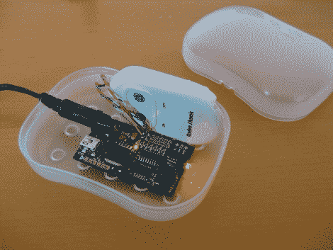

# 使射频控制的光开关与红外线一起工作

> 原文：<https://hackaday.com/2011/11/08/making-an-rf-controlled-light-switch-work-with-ir/>

[Gary]有一个射频触发的灯开关，他想找到一种方法用家庭影院遥控器控制他的灯。这个开关是他几年前从 RadioShack 买的，配有一个简单的遥控器，用两个按钮来开关灯。虽然你可能认为从射频控制切换到红外控制会是一种倒退，但[Gary]真的只想整合遥控器，而不是其他任何东西。

他设计了一个电路板，专门用于与他的射频控制器的远程部分进行交互。它配备了 PIC16F628A 微控制器，负责处理来自家庭影院遥控器的红外命令，并在需要时触发灯光。

他为这个项目开发的代码相对简单，但仍然非常有用。当他的电路板通电时，它存储接收到的第一个 IR 代码，然后只要保持通电就保留它。这使得[Gary]可以使用遥控器上的任何按钮来开关灯，而无需在软件中永久定义任何红外代码。

正如你在下面的视频中所看到的，修改后的开关正如预期的那样工作，让[Gary]在开始播放电影时不必一直走到灯的开关。

[https://www.youtube.com/embed/d6Q5vuHbI_4?version=3&rel=1&showsearch=0&showinfo=1&iv_load_policy=1&fs=1&hl=en-US&autohide=2&wmode=transparent](https://www.youtube.com/embed/d6Q5vuHbI_4?version=3&rel=1&showsearch=0&showinfo=1&iv_load_policy=1&fs=1&hl=en-US&autohide=2&wmode=transparent)