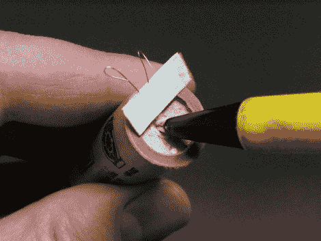

# 制作模型火箭发动机点火器

> 原文：<https://hackaday.com/2010/11/16/making-model-rocket-motor-igniters/>

斯蒂芬·琼斯有一个简单的方法来制作你自己的火箭发动机点火器模型。这项爱好中使用的固态马达在每次电触发发射时消耗一个点火器。不管你是不是在[制造自己的马达](http://hackaday.com/2010/09/28/homemade-solid-propellant-rocket-motors/)，这种构造技术应该会阻止你再次购买点火器。这个过程包括在回形针周围弯曲一些镍铬合金线，使用遮蔽胶带给引线增加一些结构支撑，并通过快速蘸油漆来绝缘商业端。

现在是向我们展示您的 launchpad hacks 的好时机。到目前为止，我们所看到的只是[水上火箭](http://hackaday.com/2010/07/30/building-a-better-water-rocket-launchpad/)的发射台。

[通过[使](http://blog.makezine.com/archive/2010/11/how-to_make_your_own_model_rocket_i.html)