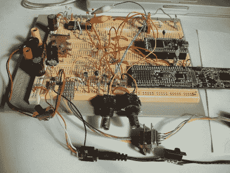

# 用 ARM 开发板制作示波器

> 原文：<https://hackaday.com/2011/08/26/making-oscilloscopes-from-arm-development-boards/>

如果你的商店角落里有一个积满灰尘的 ARM 开发板，也许你可以将它重新用作示波器。[Arend-Paul Spijkerman]能够使用 mbed 和 LPCXpresso 作为示波器的硬件端。他没有使用独立的屏幕作为显示器，而是选择将示波器读数从硬件推送到计算机进行显示。通过使用 [StampDock](http://apsdev.com/stampdock/) 作为 GUI 的基础，这被大大简化了。

他的电路图要求 LPCXpresso 使用 RS-232 连接，但 mbed 不需要。我们对 mbed 不太熟悉，不知道为什么，但也许那些知道的人可以通过留下评论给我们提供线索。探针连接非常简单，每个都由一个分压器和一对二极管组成。但上面的试验板看起来更忙，因为它内置了两个示波器电路，还有一个 10 MHz 时钟和一个 4040 纹波计数器，用于提供测试信号。