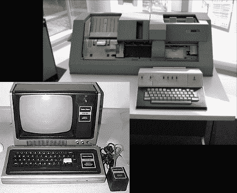

# 使穿孔卡编程变得容易

> 原文：<https://hackaday.com/2011/01/06/making-punch-card-programming-a-snap/>

大约三十年前[H. P. Friedrichs]完成了一次黑客攻击，极大地改进了穿孔卡编程的过程。当时，他的学校只有两台 IBM 029 keypunch 机器。其中一个显示在右上角，它使用键盘来选择每张卡片的哪些部分应该被打孔。这非常耗时，而且一次误击可能会毁掉你正在制作的卡片。因为你必须坐在机器前输入你的源代码，所以这些机器几乎总是在使用。

但是等等，学校获得了一打左下方的 TRS-80 计算机。它们本来是用来教授 BASIC 语言的，但[HPF]策划了一个计划，让它们在打孔卡的生成中发挥作用。他建立了自己的接口硬件，连接到新硬件的扩展端口。使用他的自定义界面，学生可以创建一个虚拟卡片组，可以重新排列和修改，以纠正源代码中的错误。然后，硬件允许虚拟牌组被转储到打孔机中。这打破了学生坐在打卡终端造成的瓶颈。

我们认为[HPF]在看到 1970 年计算器的过时硬件后，提出了这个项目。这些昔日的黑客是一个重温爆炸，所以不要害怕[提示我们](http://hackaday.com/contact-hack-a-day/)如果你知道一个有趣的。