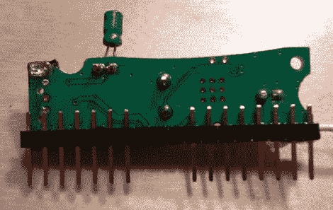

# 使即时消息加密狗更有用

> 原文：<https://hackaday.com/2011/01/26/making-the-im-me-dongle-more-useful/>

这么说，从周日开始，你已经用六种方式入侵了你的即时通讯工具，但却不知道如何使用 USB 加密狗？[Joby Taffey]开始着手让这个剩余部分成为黑客武器库的有用部分。他拔掉了 USB 连接器和 USB 控制器芯片。从那里，他粘上引脚头，如上图所示，以便把它变成一个试验板友好的单列直插式封装。但是等等，这还不是全部…为了普通组件的低-低价格，他还制作了一根电源和编程电缆。一旦一切就绪，你就可以加载 [PinkOS](http://code.google.com/p/pinkos/) ，这是他为该设备开发的操作系统，可以让你通过串行协议操作车载无线电。

需要更好地了解主板上的硬件吗？[Joby]早在 10 月份就为这次黑客攻击打下了基础。