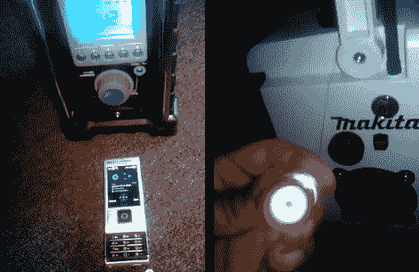

# 牧田工地电台得到了一些额外的铃声和哨声

> 原文：<https://hackaday.com/2011/10/04/makita-jobsite-radio-gets-a-few-extra-bells-and-whistles/>

[Jose] [为 Makita AM/FM 工作现场收音机](http://www.youtube.com/watch?v=hfd40-mnTAg)增加了几个功能，并且做得非常好，以至于你不能说它们不是最初设计的一部分。[原来的收音机](http://www.makita.com/en-us/modules/Tools/ToolDetails.aspx?ID=24065)有一个用于电池组的隔间，与牧田的充电工具系列一起使用，并提供 AM/FM 收音机，以及通过一对扬声器进行辅助音频播放。[Jose]通过添加一对高音喇叭来增强这些扬声器。

在他的功能列表上的下一个是几个电源总线附件。在右图中，您可以看到在设备侧面添加汽车点烟器的结果。与此相反，你会发现一对 USB 端口，由一个发光的拨动开关激活。这些端口是 USB 汽车充电器的一部分，只需轻轻一按开关，充电器就可以插入电池。

最后，还有一个内置的蓝牙音频接收器，连接到辅助输入。如左图所示，他现在可以用手机播放音乐，而不需要线缆。看到他在休息后展示视频中的设备。

[https://www.youtube.com/embed/hfd40-mnTAg?version=3&rel=1&showsearch=0&showinfo=1&iv_load_policy=1&fs=1&hl=en-US&autohide=2&wmode=transparent](https://www.youtube.com/embed/hfd40-mnTAg?version=3&rel=1&showsearch=0&showinfo=1&iv_load_policy=1&fs=1&hl=en-US&autohide=2&wmode=transparent)