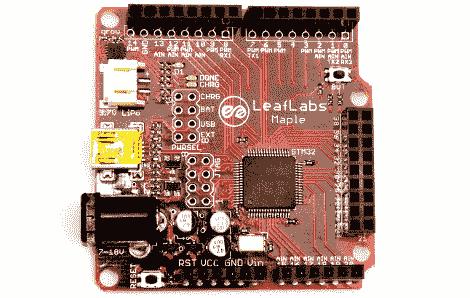

# 枫叶 R3 现已发货

> 原文：<https://hackaday.com/2010/05/24/maple-r3-now-shipping/>

Leaf Labs 现在正在发货[枫叶 R3 主板](http://leaflabs.com/2010/05/maple-r3-on-sale-and-in-stock-now-hooray/)。[菲尔·伯吉斯] [在去年秋天发布之前看了一下平台](http://hackaday.com/2009/08/22/maple-beats-up-arduino-takes-its-shields/)，高性能的原型板现在甚至更好。硬件和软件都有新的特性。引导加载程序现在可以升级，无需额外的编程硬件，有硬件 SPI 和 I2C 接口，以及一个新抛光的 Linux 和 Windows 的 IDE。售价 50 美元，这是一个获得主板中央 ARM Cortex M3 处理器强大功能的好方法。我们已经看到了几个使用[mbed](http://hackaday.com/2009/11/21/review-mbed-nxp-lpc1768-microcontroller/) 的项目，mbed 和枫树是一个级别的，但是我们还在等着看你用这个小恶魔完成了什么。