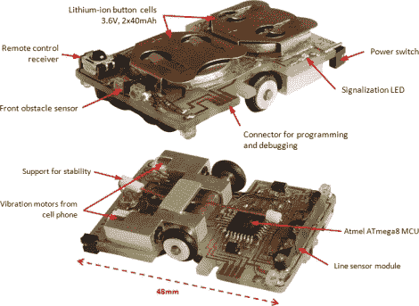

# 火柴盒大小的循线机器人

> 原文：<https://hackaday.com/2011/09/07/matchbox-sized-line-following-robot/>

虽然它们远没有自动导航的同类复杂，但制造循线机器人并不是一件简单的任务，尤其是当它们这么小的时候。这个火柴盒大小的机器人 ondřej·斯坦克的创造令人印象深刻。

PocketBot 的 48 毫米 x 32mm 毫米电路板也充当了它的框架，支持车轮，电机，微控制器等。操作的大脑是安装在机器人底部的 ATmega8 微控制器。一对轮子使用一组手机振动电机独立驱动，这些电机以高达每秒 0.35 米的速度为机器人提供动力。通过使用三个不同的红外传感器与位于机器人前端的四个红外发射器配对来实现线路检测。

PocketBot 的顶部还有一个红外接收器，允许[Ondřej]使用红外遥控器或他的计算机控制机器人，调整其参数，或在飞行中校准其传感器。

PocketBot 可能不是我们见过的绝对最小的线跟随 Bot，但它非常接近！

继续阅读以了解 PocketBot 的运行情况。

【维梅奥 http://vimeo.com/6394938 w = 470】