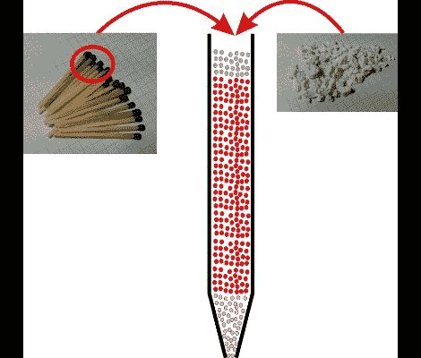

# 火柴杆模型火箭技术

> 原文：<https://hackaday.com/2011/03/25/matchstick-model-rocketry/>

[瓦伦汀]是模型火箭学的大师，[用许多人挂在家里的三样东西](http://diytechgadgets.blogspot.com/2011/03/homemade-inexpensive-rockets.html)建造一个小火箭。猫砂、火柴杆和圆珠笔是他在着手建造之前收集的原材料。

圆珠笔的外壳将充当火箭的主体。[瓦伦汀]用猫砂填满笔尖，创造出燃料室的第一部分。接下来，火柴头被小心翼翼地搅成细粉，填满了笔壳的大部分。用另一个猫砂塞完成这个，你就差不多完成了。最后一步是在笔尖的塞子层钻一个孔，形成一个喷嘴，在燃料燃烧时集中力量。

从视频来看，我们会说在火箭制导方面还需要做一些工作，但是固态燃料确实有用。像这样处理易燃物时，请记住将个人安全放在第一位！

想知道如何推出这样的东西？这里有一种方法可以让你自己制作点火器。