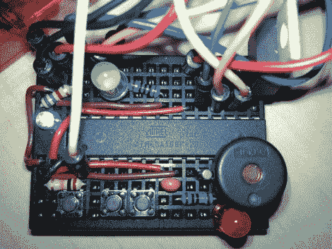

# 矩阵时钟是一个面包板赢家

> 原文：<https://hackaday.com/2010/09/22/matrix-clock-is-a-breadboarding-win/>

通常，当我们使用由 32×8 LED 矩阵制成的时钟时，我们会加载横幅照片的显示图像。但这一次，我们对[JB]的试验板工作印象深刻，我们不得不使用这张图片。我们看到一个 ATmega168、三个按钮、三个 led、一个压电蜂鸣器、32.768 kHz 晶体、平滑电容器和几个电阻器；他需要的一切来保持时间并显示在矩阵模块上。如果这只是要在你的书架上放一段时间，这是在原型板上点对点焊接的一个很好的替代方案。干得好，把所有东西都装在那里[JB]。