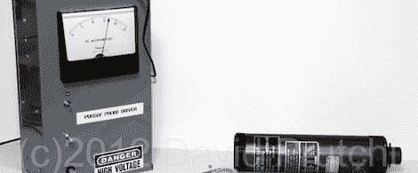

# 用军事剩余测量辐射

> 原文：<https://hackaday.com/2012/02/02/measure-radiation-with-military-surplus/>

你能在军事剩余商店里找到的东西真的很神奇。[David]刚刚用 DT-590A 闪烁探测器建造了一个辐射探测器,该探测器原本是用来测试空军基地是否被钚污染的。谁说庞大的核武库不会带来任何好处？

DT-590A / PDR-56 伽马射线探测器几年前被美国空军淘汰，它们正慢慢流入全国各地的军事剩余商店和互联网。【大卫】找到了这个探头的[手册，组装了一个](http://www.diyphysics.com/wp-content/uploads/2012/02/Repair-Manual-for-AN_PDR_56F.pdf)[小电路](http://www.diyphysics.com/wp-content/uploads/2012/02/PDR56-Circuit1.pdf)来驱动这个 x 射线传感器。该建筑使用安培计作为简单的表盘，并包括一个压电扬声器，用于先决条件盖革计数器的“点击”。

[David]还发表了一篇关于将这种 x 射线探测器转换成通用伽马探测器的帖子，这实际上使其成为真正危险的辐射*的盖革计数器。你总是可以[用你的智能手机](http://hackaday.com/2012/01/15/turn-your-camera-phone-into-a-geiger-counter/)来完成同样的任务，但是回收军用硬件会增加一点极客的信誉。*