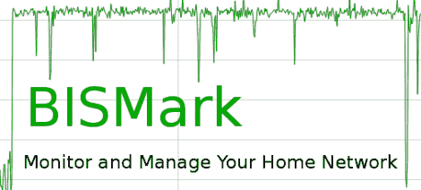

# 用 BISMark 测量家庭网络

> 原文：<https://hackaday.com/2011/07/09/measuring-home-networks-with-bismark/>

[宽带互联网服务基准](http://projectbismark.net/)是一项开源计划，旨在为普通互联网用户提供工具，使家庭网络流量的测量和分析变得更加容易。它通过测量延迟、数据包丢失、抖动、上行吞吐量和下行吞吐量来确定 LAN 和 WAN 网络利用率。当然，收集数据没有任何价值，除非你有办法展示它，为此，俾斯麦项目团队一直在开发一个网络界面，在那里你可以查看任何运行固件的人的使用情况。

该项目构建在 [OpenWRT](https://openwrt.org/) 之上，这意味着你应该能够在任何兼容 OpenWRT 的路由器上运行它。这包括无处不在的 WRT54G 路由器和许多其他路由器。我们还记得 DD-WRT 将带宽监控作为标准版本的一部分，这在有关 ISP 带宽上限的故事开始流行时确实派上了用场。我们很高兴看到这个包有更多的功能，因为很难真正了解你的网络中发生了什么。休息过后，你会看到一段详细介绍俾斯麦特征的视频。

[https://www.youtube.com/embed/v3hjp8EEJKs?version=3&rel=1&showsearch=0&showinfo=1&iv_load_policy=1&fs=1&hl=en-US&autohide=2&wmode=transparent](https://www.youtube.com/embed/v3hjp8EEJKs?version=3&rel=1&showsearch=0&showinfo=1&iv_load_policy=1&fs=1&hl=en-US&autohide=2&wmode=transparent)