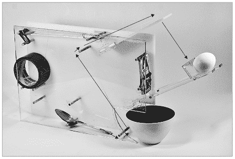

# 机械工程入门

> 原文：<https://hackaday.com/2011/03/09/mechanical-engineering-primer/>

所以你是电子大师。能够毫不费力地编写多个芯片架构的程序。对你有好处。唯一的问题是，闪烁的 led 灯过一会儿就变得很无聊，你会想做些别的事情。这是一个扩展你身体构造技能的机会。Make:技能集[分享来自【Dustyn Roberts】的《让东西移动](http://blog.makezine.com/archive/2011/03/skill-set-intro-to-mechanism-and-machines.html) 》一书的第一章。

这一章以 PDF 格式出现，涵盖了简单的机器。它将引导你了解三种不同类型的杠杆，包括你在日常生活中如何使用它们的例子。接下来是滑轮系统、轮子和轴、斜面和楔子、螺丝和齿轮。[Dustyn]通过谈论如何将这些概念结合到机器中，如上面看到的 Rube-Goldberg 设备，完成了这一章。花些时间仔细阅读这一章，如果你有兴趣阅读更多的话，把它放在公共图书馆的保留清单上。