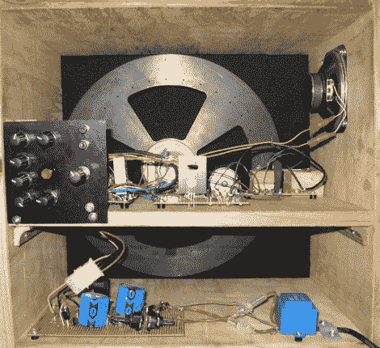

# 机械扫描电视

> 原文：<https://hackaday.com/2010/04/13/mechanical-scanning-television/>

这个项目探索了电视的早期。上图是从机械扫描电视的背面看到的景象。黑色的圆盘旋转，以螺旋模式排列的孔洞产生垂直的扫描线，让投射的光线穿过。在这种情况下，[Eckhard Etzold]使用红色、绿色和蓝色 led 来创建彩色图片。正如你在休息后的视频中看到的，它做得非常好。主要问题是[机械电视](http://en.wikipedia.org/wiki/Mechanical_television)上的扫描盘必须比实际图像大得多。要产生一个 40 英寸的图像，磁盘需要多大，旋转速度有多快？我们仍然认为这是比[并行传输视频数据](http://hackaday.com/2009/12/04/whats-the-worst-way-to-transmit-video/)更好的方法。

[https://www.youtube.com/embed/9DFcYRxFdTI?version=3&rel=1&showsearch=0&showinfo=1&iv_load_policy=1&fs=1&hl=en-US&autohide=2&wmode=transparent](https://www.youtube.com/embed/9DFcYRxFdTI?version=3&rel=1&showsearch=0&showinfo=1&iv_load_policy=1&fs=1&hl=en-US&autohide=2&wmode=transparent)

光盘加速旋转

[https://www.youtube.com/embed/L83DAJxuUsU?version=3&rel=1&showsearch=0&showinfo=1&iv_load_policy=1&fs=1&hl=en-US&autohide=2&wmode=transparent](https://www.youtube.com/embed/L83DAJxuUsU?version=3&rel=1&showsearch=0&showinfo=1&iv_load_policy=1&fs=1&hl=en-US&autohide=2&wmode=transparent)

彩色视频演示

[Thanks LeJupp]