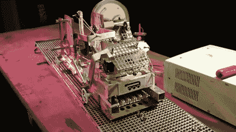

# 机械图灵机可以计算任何东西…很慢

> 原文：<https://hackaday.com/2011/03/25/mechanical-turing-machine-can-compute-anything-slowly/>

几年来，[吉姆]一直想建造一台全机械通用图灵机。在没有任何电子电路或电子输入的帮助下，他的目标是使用简单的手工工具和废弃材料建造机器。

如果你不熟悉图灵机的概念，它们是根据一套规则表从一条胶带上操纵符号或输入的设备。根据定义，图灵机应该能够模拟任何计算机算法的逻辑，尽管比你从计算机上看到的要慢得多。

他用一个金属网格代替了胶带，这些符号以滚珠轴承的形式放置在前面提到的网格上。他的手摇机器使用磁铁从网格中提取输入符号，根据他从木块中取出的规则表处理它们。

这种实现无疑是聪明的，尽管[Jim]承认它并非没有问题。他把它带到了 Maker Faire UK，如果没有完整的解释，大多数人都不太明白他们看到了什么。这台机器不像他希望的那样可靠，他想让它更强大一点，因为目前将两个数字相加需要几个月的时间。

继续阅读，看看他的图灵机运行的简短视频演示，如果你想了解更多关于机器是如何建造的信息，请查看他的博客。

有兴趣看更多的图灵机吗？看看这些两个[机器](http://hackaday.com/2009/11/30/nxt-turing-machine/)我们不久前展示过。

[https://www.youtube.com/embed/40DkJ9vt5CI?version=3&rel=1&showsearch=0&showinfo=1&iv_load_policy=1&fs=1&hl=en-US&autohide=2&wmode=transparent](https://www.youtube.com/embed/40DkJ9vt5CI?version=3&rel=1&showsearch=0&showinfo=1&iv_load_policy=1&fs=1&hl=en-US&autohide=2&wmode=transparent)