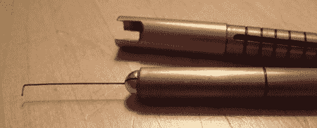

# Medeco 高安全性开锁

> 原文：<https://hackaday.com/2008/07/29/medeco-high-security-lock-picking/>

尽管最近黑客的一天似乎相当[锁重](http://www.hackaday.com/tag/lock)，我们还没有报道一个来自[最后的希望](http://www.mahalo.com/The_Last_HOPE_Conference)的重大故事。在会议上，[Jon King]谈到了 [Medeco](http://www.medeco.com/) 锁中的漏洞，并展示了他的 Medecoder 工具。Medeco 让这个故事变得有趣。与欧盟不同，美国几乎没有高安全性锁制造商。你几乎必须使用 Medeco，它在许多政府机构中都有。

Medeco 锁有一排垂直排列的六个销，就像大多数弹子锁一样。与普通锁不同，锁销的旋转很重要。当钥匙插入锁中时，它不仅将锁销移动到正确的高度，还将锁销旋转到正确的方向。除非销子旋转正确，否则侧杆会挡住锁芯。每个引脚有三种可能的方向。它们也是双轴的，这意味着引脚的偏移点允许三个以上的可能位置。

[Jon King]的 Medecoder 工具有助于处理侧边栏问题。锁中的每个插销都有一个凹槽。当插销处于正确的方向时，这些凹槽都垂直于锁体，侧杆可以滑动到位。[Jon]的 Medecoder 工具是一根带有滑动刻度的细金属丝，可以帮助你正确定位这些凹槽。

要撬开锁，你首先要把所有的插销调到正确的高度。然后，使用 Medecoder 找到每个引脚的单独凹槽。所有 Medeco 锁的插销与锁面的距离相同。Medecoder 上的刻度指示大头针当前的位置和应该在的位置。你可以看到[乔恩]用这种技术在舞台上用不到三分钟的时间打开了一把锁。

自 1974 年以来，此 pin 漏洞在 Medeco 锁中就已为人所知。随着最近 Medecoder 的发布，Medeco 又开始生产 ARX 别针。ARX 销没有一直切到键槽的槽，所以它们不能被工具操纵。正如我们之前提到的，与软件公司不同，物理安全公司[没有义务修补他们的安装基础](http://www.hackaday.com/2008/07/28/lock-picking-and-security-disclosure/) …即使他们知道它已经以某种形式损坏了 30 年。

最新一期的《NDE》刚刚发行，其中有一篇关于 Medecoder 的完整报道。它还详细介绍了已开发的不同种类的 ARX 别针。

[图片:[黑袋](http://www.toool.nl/blackbag/?p=213)

*   [永久链接](http://www.ndemag.com/nde4.html)