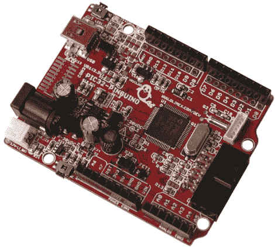

# 认识 Pinguino——一个完全开放的基于 PIC 的开发平台

> 原文：<https://hackaday.com/2011/10/06/meet-the-pinguino-a-completely-open-pic-based-dev-platform/>

来自 Make [的[Phillip Torrone]最近与 Pinguino 的创造者[Jean-Pierre Mandon]和[Tsvetan Usunov]](http://blog.makezine.com/archive/2011/10/meet-the-pinguino.html) 坐在一起，听取更多关于他们产品的信息。虽然这个名字听起来可能不太熟悉，但我们确信随着时间的推移，您将会看到更多这种开发平台。

Pinguino 本质上是由制造商为制造商创造的，是一个基于 32 位 PIC 的 Arduino 兼容原型平台，很像 Microchip 的 chipKIT。Pinguino 与 chipKIT 一样，拥有 100%的 Arduino 兼容性，尽管他们的工具链是从头开始构建的，这意味着它是完全开源的。Pinguino 甚至包括一个板载 microSD 插槽和一个内置 Li-Po 充电器——这两个巨大的功能使其成为一个可靠的 chipKit 竞争对手。

Phil 与这对搭档讨论了 Pinguino 的历史，深入探讨了两个平台之间的技术差异，以及他们计划在未来将该平台带往何处。对于任何对开放软件和硬件感兴趣并考虑尝试芯片套件的人来说，这无疑是一本有趣的读物。