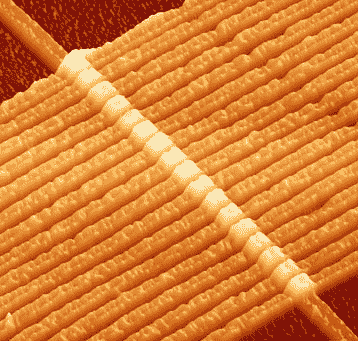

# 2009 年基于忆阻器的存储器原型

> 原文：<https://hackaday.com/2008/07/11/memristor-based-memory-prototype-by-2009/>

《EETimes》上的一篇文章暗示，我们最早可能在 2009 年看到基于忆阻器的存储器原型。[忆阻器](http://www.eetimes.com/news/latest/showArticle.jhtml?articleID=207403521)被许多人认为是理论上的第四种无源电路元件，连接电荷和通量的基本电路变量。对于大多数计算机爱好者来说，这个消息听起来可能并不令人兴奋，但这种新组件可能会通过形成 RRAM(电阻随机存取存储器)的基础，开创计算机存储器的新时代。

惠普实验室的科学家最终证实，忆阻器的行为与他们的理论预测一致。该组件对内存如此有效的原因是，该过程是非易失性的，并且位本身只有在 CPU 告诉它们改变后才会改变。当前 DRAM 系统中的位慢慢淡出，每 50 纳秒需要刷新一次。

[经由 [/。](http://hardware.slashdot.org/article.pl?sid=08/07/11/2027228&from=rss) 

*   [永久链接](http://www.eetimes.com/news/design/rss/showArticle.jhtml?articleID=208803176)