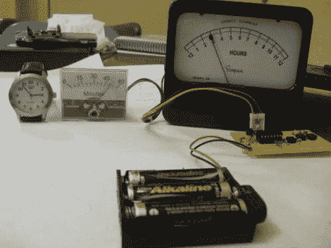

# 使用 TI Launchpad 的仪表时钟

> 原文：<https://hackaday.com/2010/09/02/meter-clock-using-the-ti-launchpad/>

这里有一个使用 MSP430G2211 微控制器的[模拟仪表时钟。【道格·帕拉迪斯】选择这款处理器是因为它是](http://www.instructables.com/id/MSP430-Based-Chronulator-using-Launchpad-chip)[TI launch pad](http://hackaday.com/2010/06/22/ti-makes-a-big-bid-for-the-hobby-market/)配备的两款处理器中较小的一款。零件数量也相当少；一个时钟晶体、两个模拟仪表、几个按钮和一个电压调节器。

他做得很好。我们鼓励你亲自尝试一下，并在[Doug 的]功能上有所建树。我们真的很喜欢[【艾伦的】万用表时钟](http://hackaday.com/2010/06/24/multi-multimeter-clock/)中的校准子程序。实现该功能并将校准代码存储在 MSP 的闪存中会很有趣。如果你需要一个如何在闪存中存储数据的例子，你可以使用[我们移植的车库门开启器代码](http://hackaday.com/2010/08/13/porting-code-to-msp430/)。