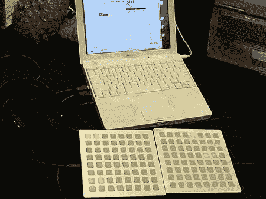

# 单体

> 原文：<https://hackaday.com/2006/04/22/mf2006-monome/>

[单体](http://monome.org/index.php?m=00)项目的人在集会上全力以赴。他们有五个 8×8 的垫子供人们玩耍。上图中的前两个实际上是一个 16 步循环系统。还有一个作为混音器，另一个作为鼓机。第五个是显示来自 iSight 的像素化视频。这箱子造得真好。500 美元的价位让很多人感到震惊，但这确实是不可避免的，因为他们只做了 200 台设备的运行。我以前没有意识到的是，按钮是设备独有的，而不是现成的部件。该按钮实际上是一个橡胶帽，位于 LED 上方，底部有一个导电环。我希望他们贴出一张 8×8 矩阵控制器的原理图，这样任何人都可以制作一个。下面再来几张:[一张](http://www.flickr.com/photos/hackaday/133020701/)、[两张](http://www.flickr.com/photos/hackaday/133020704/)、[三张](http://www.flickr.com/photos/hackaday/133020705/)。

*   [永久链接](http://monome.org/index.php?m=00)