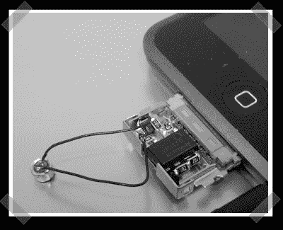

# IPod Touch 基座接口中的麦克风前置放大器

> 原文：<https://hackaday.com/2007/11/28/mic-preamp-in-an-ipod-touch-dock-connector/>

【玛丽安】送来了他为 iPod touch 打造的可爱的小[麦克风前置放大器](http://touchmods.blog.com/2350444/)。他在带有 SMD 元件的 TLC272 运算放大器的引脚上构建了[电路](http://touchmods.blog.com/2340723/)。整个东西实际上可以放在标准 iPod 基座接口的盖子里。
奖励:[tnkgrl]在她的[电路追踪努力](http://www.hackaday.com/2007/11/20/asus-eee-trace-hunting/)后，给她的 eeePC 加了一个 [USB 蓝牙适配器](http://tnkgrl.wordpress.com/2007/11/28/modding-the-asus-701-eee-bluetooth/)。

*   [永久链接](http://touchmods.blog.com/2350444/)