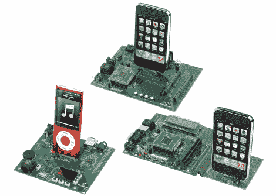

# 微芯片在 IPhone 和 IPod 上的 PIC 开发

> 原文：<https://hackaday.com/2010/03/29/microchips-pic-development-for-iphone-and-ipod/>

派对似乎有点晚了，但 Microchip 刚刚宣布了用于苹果产品的 PIC 开发板系列。[的三个产品](http://www.microchip.com/stellent/idcplg?IdcService=SS_GET_PAGE&nodeId=2872&param=en546067)包括一个数字音频开发套件、8 位配件开发和充电套件，以及一个用于 iPhone 或 iPod 的 16 位配件开发和充电套件。

我们已经看到了很多使用微控制器的自制苹果插件。这不仅将硬件接口带到了一个新的水平，而且在苹果的祝福下实现了[。但不知何故，这似乎没那么有趣。](http://developer.apple.com/ipod/)

[谢谢胡安]