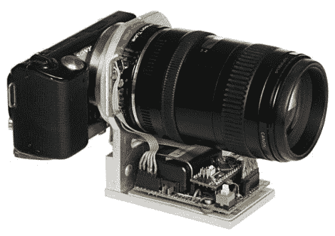

# 微控制器让你更好地控制你的相机镜头

> 原文：<https://hackaday.com/2012/02/24/microcontroller-gives-you-more-control-of-your-camera-lens/>

这里有一种方法可以更好地控制你的相机镜头。[弗拉基米尔]建造了一个基于 Arduino 的传递环([翻译为](http://translate.google.com/translate?sl=auto&tl=en&js=n&prev=_t&hl=en&ie=UTF-8&layout=2&eotf=1&u=http%3A%2F%2Fwww.ixbt.com%2Fdigimage%2Fcanonautosonyl.shtml))，它拦截自动镜头控制。这意味着与佳能 EOS 镜头一起使用，佳能 EOS 镜头有自己的电子设备，可以控制像聚焦和变焦这样的事情。

看起来这里的部分动机是使用其他品牌相机的镜头。但[Vladimir]也谈到了改进某些在特定气候条件下表现不佳的传感器的可能性(想想晶体振荡器如何随着温度变化而漂移)。

机器翻译有点粗糙，但似乎适配器环仍然使用从相机发送的设置，但有 Arduino 克隆将它们翻译成镜头期望的格式。除此之外，在镜头旁边的小 PCB 上还有一组按钮，可以微调光圈。

这是一篇冗长的文章，但还有两篇文章将有助于填补这种技术如何与不同的镜头模型配合使用的空白，以及一些关于如何使用它的更多提示。

[谢谢瓦西里]