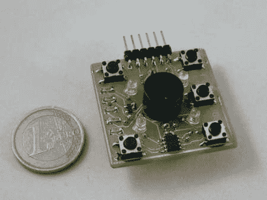

# 微型西蒙

> 原文：<https://hackaday.com/2011/02/06/microsimon/>

[Simoninns]希望凭借这款[超酷的微型机器人](http://www.instructables.com/id/MicroSimon/)参加 Sparkfun 微控制器大赛。零件清单很小，大约有 20 个零件。核心是 PIC 12F683 微控制器。整个项目有很好的文档，有原理图、PCB 布局、代码和很棒的图片。这是一个很棒的项目，你可以很快地把它组合在一起，这是一个[对 charlieplexing](http://hackaday.com/2008/12/03/intro-to-charlieplexing/) 的完美介绍。我们发现，尤其是在教一个新人的时候，游戏通常是一个很好的学习项目。成品的互动性和竞争性通常会让人们保持更长时间的兴趣。休息之后你可以看一段视频。

[https://www.youtube.com/embed/p4u700xVRqw?version=3&rel=1&showsearch=0&showinfo=1&iv_load_policy=1&fs=1&hl=en-US&autohide=2&wmode=transparent](https://www.youtube.com/embed/p4u700xVRqw?version=3&rel=1&showsearch=0&showinfo=1&iv_load_policy=1&fs=1&hl=en-US&autohide=2&wmode=transparent)