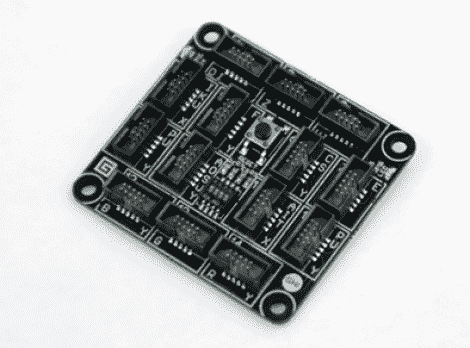

# 微软对 Arduino 黑仔的尝试——感觉像是一个噱头

> 原文：<https://hackaday.com/2011/08/03/microsofts-attempt-at-an-arduino-killer-feels-like-a-gimmick/>

微软已经把帽子扔进了开源硬件爱好市场。他们的产品被称为小玩意。我们很想告诉你关于它的一切，但大 M 并没有让它很容易找到关于该设备及其插件。当我们开始寻找主板上运行的处理器时，我们很高兴地看到他们称之为开源硬件项目，但没有公布原理图。当我们最终导航到硬件文档时，它是一个必须下载的文件，在获取它之前，您必须同意他们的许可。这就是我们所做的，现在我们将回到使用更开放的工具。

对于那些没有被缺乏开放性吓到的人来说，你会注意到的第一件事就是它充满了连接器插头。与 Arduino 使用的小排线不同，Gadgeteer 打算使用带状电缆来连接各种分线板。您可以使用。NET 框架。这意味着对于那些已经熟悉该平台的人来说，可以使用 Microsoft Visual Studio。但是普通读者会注意到，我们总是在 ide 中寻找对 Linux 的支持，而你在这里找不到。

[通过 [Slashdot](http://hardware.slashdot.org/story/11/08/03/0012203/NET-Gadgeteer-mdash-Microsofts-Arduino-Killer) 感谢 Hrasdt(和其他几个人)