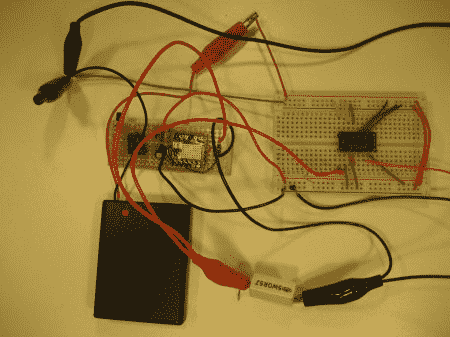

# 毫欧测量变得简单

> 原文：<https://hackaday.com/2011/08/17/milliohm-measurement-made-easy/>

当[Kerry]想要非常精确地测量一些非常小的电阻时，他不想花大价钱买高端万用表或微欧计，所以他决定自己做一个。测量电阻是一个足够简单的概念，它直接实现了欧姆定律(V=IR)。电阻很小的问题是，当你对负载施加一个适当大小的恒定电流时，要测量的电压对于传统的万用表来说太小了。

为了解决这个问题,[Kerry]利用单位增益差动放大器 AD8276 和高精度运算放大器 AD8603 设计了一个非常高精度的恒流源。然后，为了提高负载上的电压，他使用了 LMP8358 可编程增益精密运算放大器，这使他能够轻松地改变不同大小电阻的增益，他的网站上提供了所有电路图。最后，他使用四点探针来消除探针线电阻误差，最终能够以非常高的精度测量小电阻。