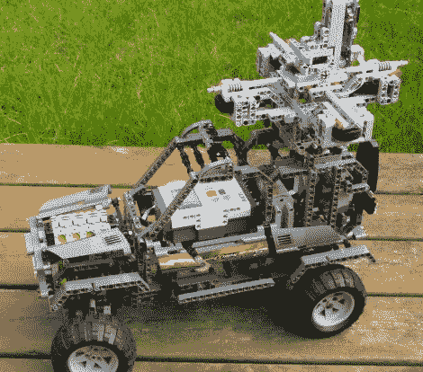

# 乐高打造的迷你谷歌街景车

> 原文：<https://hackaday.com/2011/06/20/mini-google-street-view-car-built-from-lego/>

[Mark]正在摆弄一个小型 GPS 传感器，这时他头上的一个灯泡亮了。他想象用乐高 NXT 零件按照比例的一小部分复制一辆谷歌街景车会很酷。他认为在一辆遥控汽车上安装几个摄像头，在行驶过程中记录图像和 GPS 坐标是很容易的。

迷你街景车由单个 NXT 模块控制，该模块通过他购买的 PSPNx 传感器接收来自 PS2 控制器的命令。汽车上安装了三个摄像头，当被他的遥控器触发时，这些摄像头可以拍摄各个方向的照片。一些额外的电机也用于驱动汽车，转向，并激活相机的快门释放。

这辆车在测试中表现不错，但是[马克]说还有很大的改进空间。他目前在可靠地触发所有摄像头方面有问题，但我们相信他很快就会解决这个问题。

请继续阅读，观看他驾驶迷你街景车的视频。

[https://www.youtube.com/embed/ysyjGkcTTw4?version=3&rel=1&showsearch=0&showinfo=1&iv_load_policy=1&fs=1&hl=en-US&autohide=2&wmode=transparent](https://www.youtube.com/embed/ysyjGkcTTw4?version=3&rel=1&showsearch=0&showinfo=1&iv_load_policy=1&fs=1&hl=en-US&autohide=2&wmode=transparent)