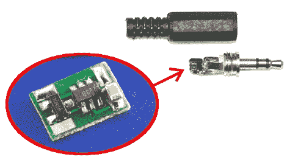

# 微小间距计

> 原文：<https://hackaday.com/2010/08/06/miniscule-intervalometer/>

称这位采访者渺小是一种明显的保守说法。它足够小，可以放在塑料盖子内，供佳能 DSLR 相机使用的 2.5 毫米插孔使用。我们应该指出，我们放在一起的形象有点误导。插孔的图片是此电路的[版本 1](http://cms.diodenring.de/electronic/microcontroller/81-intervalltimer) ，使用 8 针 SOIC 芯片。椭圆形中的板是版本 2，PIC 10f222 SOT23-6 封装使其**比原始版本**更小。

这是用于延时摄影的。插上电源后，芯片从相机中获取能量。听听这个:它通过听前两个图像来学习时间间隔。一旦你拍下了前两张照片，PIC 将会根据最初的延迟继续拍摄。太神奇了。

【感谢 AW via [DIY 摄影](http://www.diyphotography.net/the-smallest-intervalometer-in-the-world)