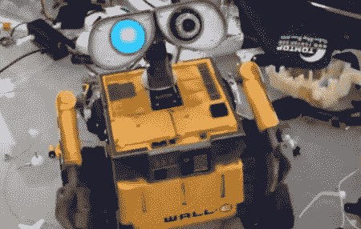

# 改造后的瓦力变成了真正的机器人

> 原文：<https://hackaday.com/2011/07/22/modded-wall-e-becomes-a-real-robot/>

[DJ Sures]得到了一个塑料瓦力玩具，并决定[制造一个机器人](http://www.dj-sures.com/Blog/2011-07-20+Calgary+Real+Wall-E+Robot)，它包括一个摄像头、语音识别和物体跟踪。结果是*很可爱*所以我们在休息前放这个视频:

[https://www.youtube.com/embed/OJiMUzJHYFk?version=3&rel=1&showsearch=0&showinfo=1&iv_load_policy=1&fs=1&hl=en-US&autohide=2&wmode=transparent](https://www.youtube.com/embed/OJiMUzJHYFk?version=3&rel=1&showsearch=0&showinfo=1&iv_load_policy=1&fs=1&hl=en-US&autohide=2&wmode=transparent)

Wall-E 是围绕一个 [EZ-B 蓝牙机器人控制器](http://www.ez-robot.com/Shop/View.aspx?id=1)打造的。所有软件功能都由配套的 EZ-builder 软件处理。所有这些都不是革命性的——我们 1998 年的乐高头脑风暴 RCX 可以用乐高相机处理物体跟踪。Wall-E 体内有 5 个伺服系统以及一个易贝 2.4 GHz 无线摄像头。

[DJ Sures]有很多改装玩具机器人的经验。Dalek 建造的和医生忠实伙伴的玩具机器人版本 [K9](http://www.youtube.com/watch?v=C1m4DQC5kdY#t=41) 是我们最喜欢的建造。这也不是他第一次建造瓦力；[DJ Sures]去年建造了一个，但这是第一个具有这么多功能的 Wall-E。现在，我们认为瓦力需要一个女朋友。也许是类似于[悬浮球形机器人](http://hackaday.com/2011/06/10/spherical-military-drone-coming-to-a-sky-near-you/)的东西？