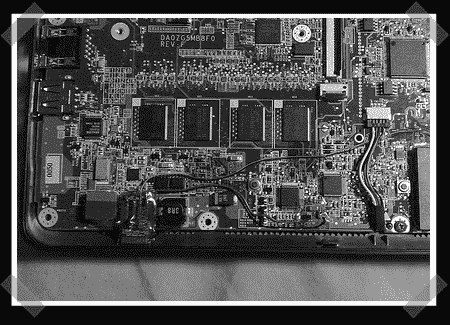

# 用蓝牙改装宏碁 Aspire One

> 原文：<https://hackaday.com/2008/08/14/modding-the-acer-aspire-one-with-bluetooth/>

【tnk grl】这里的常客，又来了。这次她将宏碁 Aspire One subnotebook 改装成内置蓝牙。她发布了关于增强 Aspire One 的多部分教程的第 1 部分。在这一部分中，她介绍了反汇编、添加更多 RAM 以及添加蓝牙硬件。她建议你看看她在华硕 701 上安装的[蓝牙，了解更多信息，因为过程几乎相同。](http://tnkgrl.wordpress.com/2007/11/28/modding-the-asus-701-eee-bluetooth/)

本教程的第 2 部分将介绍如何将 SSD 升级到 1.8 英寸 PATA 硬盘，并将其重新组装起来。

*   [永久链接](http://tnkgrl.wordpress.com/2008/08/14/modding-the-acer-aspire-one-bluetooth/)