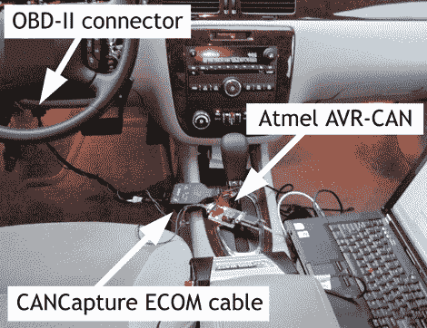

# 现代汽车数据系统缺乏安全性

> 原文：<https://hackaday.com/2010/05/18/modern-car-data-systems-lack-security/>

明天[一组研究人员](http://www.autosec.org/)将在 [IEEE 安全研讨会&隐私](http://oakland31.cs.virginia.edu/)上展示他们关于[现代汽车](http://www.autosec.org/pubs/cars-oakland2010.pdf)实验安全分析的论文(PDF)。很像[赛车模拟器](http://hackaday.com/2010/04/23/driving-the-car-without-going-anywhere/)我们已经看到他们正在利用 ODB-II 端口来获取车辆的控制器局域网络，或 CAN 总线。他们可以在仪表板显示器上显示自定义文本或从汽车上读取传感器数据，对此我们一点也不惊讶。让我们吃惊的是，他们揭露了该系统是多么不安全。似乎访问 CAN 总线上的任何设备都能让他们不受阻碍地控制汽车系统。任何设备都可以向任何其他设备发送命令。他们甚至发现了一种向汽车电脑中写入恶意代码的方法，这种程序可以在撞车时自动清除。

就像 RFID 一样，这里的安全风险对绝大多数消费者来说基本为零。我们只是觉得有点令人惊讶的是，显然很少有人考虑加强安全系统之间的通信，例如车辆的刹车。例如，团队尝试通过 CAN 总线发送随机数据包，偶然发现了一种锁定一个车轮刹车的方法。对我们来说，可以想象网络上出现故障的设备可能会开始发送损坏的数据包，并导致类似这样的危险故障。

上面链接的 14 页 PDF 令人爱不释手，午餐时在你被黑的电子书阅读器上看看吧。