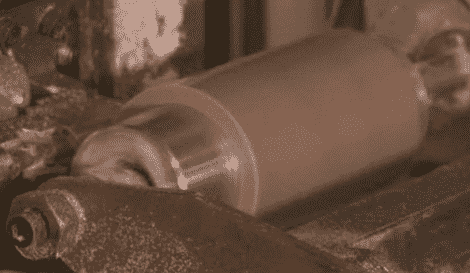

# 蜡缸上的现代录音

> 原文：<https://hackaday.com/2010/06/01/modern-recordings-on-wax-cylinder/>

如果你认为你永远没有机会在蜡像馆发行你的热门单曲，那就再想想吧。一个痴迷于维多利亚时代的乐队就是这样做的，让 DIY'er 为他们生产圆柱体。BBC 报道了这个[故事，其中包括一个糟糕的尝试，试图建造一个留声机来回放录音。视频展示了他们的工艺(或缺乏工艺)，但它甚至不能与我们去年九月看到的杰作](http://news.bbc.co.uk/2/hi/technology/10171206.stm)[相提并论。然而，你可以在剪辑中看到大约 2:45 时使用的制作设备。](http://hackaday.com/2009/09/24/edison-cylinder-recordings-need-more-cowbell/)

[谢谢查尔斯]