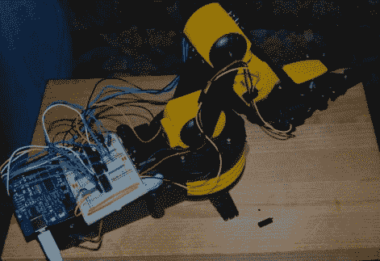

# 为 Arduino 控制改造一个便宜的机器人手臂

> 原文：<https://hackaday.com/2011/06/15/modifying-a-cheap-robot-arm-for-arduino-control/>

许多黑客已经组装了一个便宜的 30 美元的机器人手臂套件，你可以在任何商店买到，上面有一个标有“科学”的部分。在一个正在进行的寻找廉价机器人手臂的过程中，[拉里]决定修改其中一个，通过 Arduino 用 PC[控制。这篇文章也是直流电机控制的基础教程。在网站上，他给出了如何使用 H 桥的简要说明，并很好地解释了他是如何为此目的连接 H 桥的。他最终继续为项目添加了一个](http://luckylarry.co.uk/arduino-projects/arduino-modifying-a-robot-arm/)[处理接口](http://luckylarry.co.uk/arduino-projects/arduino-modifying-a-robot-arm-part-2/)。下一步将是弄清楚如何添加某种位置反馈，如编码器。不过，如果修改手臂不是你的风格，[拉里]有另一篇很酷的文章，关于用一些泡沫板和业余爱好伺服系统廉价地滚动你自己的[机器人手臂](http://hackaday.com/2010/07/15/foam-board-servo-driven-arm/)。