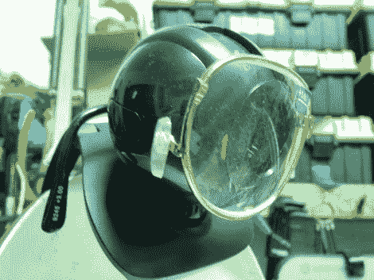

# 单片眼镜修复网络摄像头远视

> 原文：<https://hackaday.com/2010/03/03/monocle-fixes-webcam-farsightedness/>

[Vik Oliver]想出了一个快速简单的网络摄像头对焦修复方法,这是我们从未想到过的。他收到了一个网络摄像头作为礼物，并安装在一个铰接灯上，这样就可以很容易地放置在他的项目周围。问题是相机没有调整焦距，所以特写镜头很模糊。

在我们认为的[灵光一现的时刻](http://en.wikipedia.org/wiki/Eureka_%28word%29)，他从一元店购买了一副老花镜来修理光学系统。眼镜自带安装支架。他把它们剪成两半，然后把金属丝耳朵支架缠绕在相机机身上。伟大的黑客[不一定是复杂的](http://hackaday.com/2008/07/20/simple-fish-feeder/)，我们需要更好地在[一元店寻找项目零件](http://hackaday.com/2009/11/12/raid-the-dollar-store-for-an-illuminated-umbrella/)！