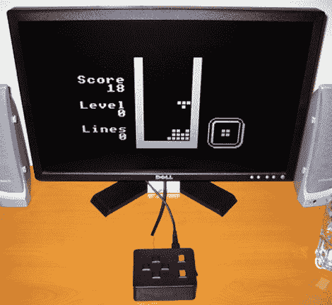

# 更多 AVR 俄罗斯方块

> 原文：<https://hackaday.com/2010/01/18/more-avr-tetris/>

[Ben]制作了一个基于 AVR 的俄罗斯方块游戏，使用电视作为显示器。他在上周报道的 [AVR 俄罗斯方块项目](http://hackaday.com/2010/01/14/avr-tetris/)的评论中联系了他的项目。他的作品利用他自己的[电视文本库](http://benryves.com/projects/tvtext)来处理合成视频。使用电视消除了所有的硬件工作，只留下复合插孔和几个按钮来连接 ATmega168 和它的 20MHz 时钟。休息之后我们嵌入了游戏视频。它是黑色和白色的，但也是干净和干净的。

[Ben]没有在他的版本中加入音乐，但是另一位评论者[Eric]，[已经开始在](http://www.youtube.com/watch?v=-QWHf0T7mCE)中加入音乐。我们不禁认为[他们俩应该早点向我们透露他们的项目。](http://hackaday.com/contact-hack-a-day/)

[https://www.youtube.com/embed/vZwySWBNNYw?version=3&rel=1&showsearch=0&showinfo=1&iv_load_policy=1&fs=1&hl=en-US&autohide=2&wmode=transparent](https://www.youtube.com/embed/vZwySWBNNYw?version=3&rel=1&showsearch=0&showinfo=1&iv_load_policy=1&fs=1&hl=en-US&autohide=2&wmode=transparent)