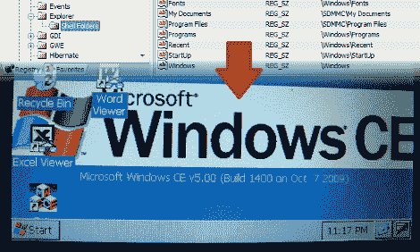

# 几分钟内实现更多功能的 GPS

> 原文：<https://hackaday.com/2010/03/21/more-functional-gps-in-minutes/>

[Sparky]通知我们他的黑客攻击允许与 Aldi GO Cruise 4300 GPS Windows CE 操作系统的核心进行交互。所有需要的是一些程序和注册表编辑的 GPS，任何人都可以在几分钟内完成。但是我们建议你慢慢来，仔细检查你的工作；没有人想要一个砖砌的系统。完成后，你可以运行这些伟大的程序，比如[Sparky]为 4WD 爱好者建议的那个， [Ozi Explorer](http://www.oziexplorer.com/) 。