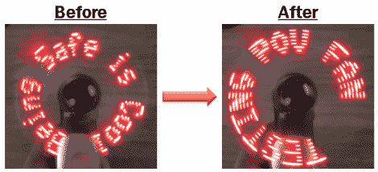

# 更多 POV 粉丝留言黑客

> 原文：<https://hackaday.com/2011/08/27/more-pov-fan-message-hacking/>

[Zach 的]公司注重安全，为了强化这些理念，他们向每位员工分发了 POV 显示器风扇。“安全就是酷”，明白吗？噱头…是的，但现在[扎克的]有了一个小小的 POV 粉丝来黑。虽然他可能不知道，但这不是我们第一次看到这种硬件。几年前，这些粉丝在黑帽公司被作为促销活动分发，并促使[采取了一些逆向工程行动](http://hackaday.com/2009/10/09/pov-fan-eeprom-hack/)。信息存储在 EEPROM 上，甚至还有一个女性编程头，如果你知道如何处理数据，就可以很容易地用你自己的信息重新编写它。

这就是这两种产品的不同之处。旧项目使用串行连接和 PonyProg 来转储数据。[Zach]第一次尝试使用他的 Bus Pirate 来转储数据，但在没有成功之后，他抓住了他的 Arduino 并成功完成了工作。一旦信息编码协议制定出来，他就写了一个草图来刷新 EEPROM。所以如果你能得到其中的一个，工作已经完成了。休息后在视频中看到[Zach 的]自定义消息。

但我们希望看到这种关系更上一层楼。有没有一种壁挂式设备可以等待收到邮件或推文，然后转动风扇显示出来？

[https://www.youtube.com/embed/eL-aNIXz5_w?version=3&rel=1&showsearch=0&showinfo=1&iv_load_policy=1&fs=1&hl=en-US&autohide=2&wmode=transparent](https://www.youtube.com/embed/eL-aNIXz5_w?version=3&rel=1&showsearch=0&showinfo=1&iv_load_policy=1&fs=1&hl=en-US&autohide=2&wmode=transparent)