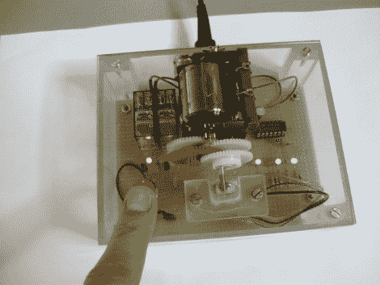

# 最没用的机器升级——现在只需一个按钮！

> 原文：<https://hackaday.com/2011/08/07/most-useless-machine-upgrade-now-with-a-button/>

我们心中对无意义的项目有一种好感，只要它们执行得好。[Bertho]在最没用的机器上取得了成功。我们已经看到了这个概念的几种版本，其中大多数都依赖于[一个每当你打开](http://hackaday.com/2009/12/30/simplest-most-useless-machine/)时就会关闭机械开关的盒子。但是这个镜头使用一个按钮来激活机器另一部分的开关翻转机制。

你可以在上图中看到驱动齿轮。最后一个齿轮有一个小杆，可以将开关拨到一边或另一边。该电路无需微控制器即可实现这一点。一个 7400 系列与非门芯片、一些无源元件和两个机械继电器就是全部。每次按下按钮，逻辑芯片都会触发一个继电器，根据开关的当前状态触发相应的电机方向。你可以在移动过程中按下按钮，但这只会推迟不可避免的开关翻转。