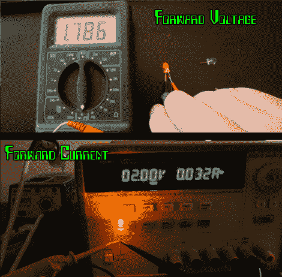
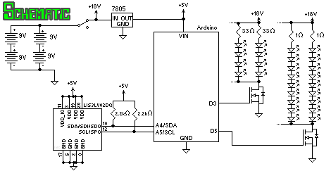
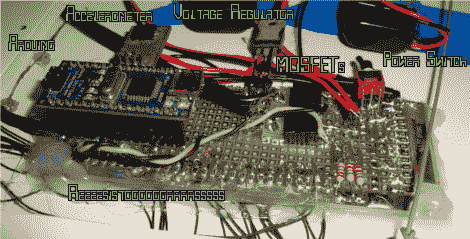
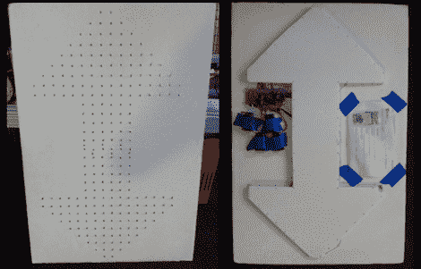

# 运动控制的 Reddit 投票标志。

> 原文：<https://hackaday.com/2011/04/27/motion-controlled-reddit-vote-sign/>

## **
**

不久前，我参加了东海岸最大的一次聚会，来自曾经流行的社交新闻网站 Reddit.com。熟悉 Reddit 的人都知道它是关于链接聚合的。用户发布感兴趣的网站和材料的链接，然后可以根据兴趣或相关性投票赞成或投票反对内容。通过神奇的网站算法，原创和有趣的内容，正如所暗示的，被聚集到首页。这个 DC 大事件的异想天开的性质导致许多人提供基于网站文化、互联网迷因等各种类型的标志。真正引起我注意的标志主要基于网站的风格布局、放大的邮件图标和其他 Reddit 特定的图形。

使用网站图形的概念给了我一个想法，那就是能够亲自投票赞成或反对其他人的标志。做一个纸板箭太容易了，而且我没有彩色打印机。我碰巧有一个搁置的咖啡桌项目，涉及橙色和蓝色发光二极管。和箭头颜色一样！太好了。为了完成这个项目，我必须完全从我的项目堆中开始工作，根本没有时间从网上订购任何东西。我设法在集会前的 3 天(和的早上)制作了一个功能性的上/下投票标志，以下是我所做的:

## **我家里有什么:**

*   橙色和蓝色发光二极管–各 124 个。目前被搁置的咖啡桌项目的附加项目。
*   面包板——我有很多这种东西，表面贴装友好型方形！
***   MOSFET–另一个搁置的项目，一个电机控制器，因此这些可以处理许多安培。*   电阻——我只有所需阻值的 SMD 电阻，这变成了一个巨大的麻烦。*   arduino Nano——我让这个项目免费使用，就是为了这样一个场合。*   特里普轴 I2C 加速度计——很久很久以前，我做了一个小分线板和烤箱焊接的东西。对于这个项目，我们只需要三个轴中的一个。*   SPDT 开关。*   电压调节器 Arduino 技术上可以产生足够的 5v 电压来驱动一切，但我决定不冒这个险。*   一把对得起泡沫板的刀，我用的是笔刀。*   镊子，焊料，烙铁，电线，稳定的手，耐心。**

 **## **我必须得到的东西:**

*   海报板——工艺品商店！
*   热熔胶——工艺品商店！
*   9V 电池夹–这是一个仓促的决定，我在活动当天就收到了！

## **布置发光二极管:**

现在是时候重新创建像素图形了。该网站有一个非常简单的低分辨率图形，下面是一个被激活的投票按钮的特写。

 ****
**

由于我的 LED 比 sense 多得多，我决定在像素的交叉点放置一个 LED。所有这些关于如何漫射光线的伟大想法都被扔来扔去，蜡纸什么的，它们看起来会很神奇，但时间介入了。我不得不选择一个策略并执行它。我在钉板上画出了像素图，并用这些洞作为指导，每个箭头总共有 124 个发光二极管。为了适合一英寸的正方形，箭头相互重叠。该设计被绘制到钉板(再次是咖啡桌项目)上，然后被转移到一些泡沫芯海报板上。


这为所有的 led 留下了一个很好的指南。有公司生产非常特殊的泡沫板打孔机，但我当地的工艺品商店没有类似的东西。所以我被迫用钢笔刀勺钻这些洞，都是 248。


一旦所有的孔都钻好了，我就必须把 led 压进它的槽里，这是相当费力的。5 毫米的 led 确实会伤害你的手指。


我试图通过在图案中隔开最后几个 led 来获得箭头梯度，它变得*正常*。一些电阻微调可以产生更令人信服的淡出。双橙色/蓝色发光二极管会更酷。为了保护所有的线路和发光二极管，我在标志的背面粘了一个箭头形状的泡沫芯(扩散实验留下的)，这让太多的光通过边缘发光二极管的背面。我建议切一个稍微大一点的背衬，用弱粘合剂或 Velcro 把它粘上，以便将来能接触到电子设备。

## **电路:**

现在所有的 LED 都安装好了，我把一些关于我的设置的变量插入到一个 LED 计算器中。我不得不通过实验来确定一些数值，因为蓝色和橙色略有不同，而我早已丢失了与它们相关的任何数据。我的源电压是 18v，我用万用表找到电压降，用电流表测量电源的 led 正向电流。



计算器告诉我，我可以将橙子串成 9 串，每串一个 1ω电阻。橙色阵列将从电池中消耗 448 毫安。蓝调每个消耗 4 伏，70mA 左右(！！).蓝色电线四根一组，每条链上有一个 33ω的电阻。蓝色 led 从光源汲取 2.1A 的电流。这是当我决定从一个电机项目的重型 MOSFETs。然后将发光二极管的引线向下弯曲，将它们连接在一起。由于我只有表面贴装电阻，我不得不使用身边的一些绕线将所有 LED 正极导线回接到 PCB，这是通孔电阻和粗总线导线可以让生活变得更容易的情况之一。LED 接地是用一些低规格的总线导线制作的，并针对标牌的上/下部分分开。



开关很有趣，人们喜欢好的 SPDT。它们很结实，可以处理大量电流…它们真的很擅长切换 led。你知道人们真正喜欢什么吗？加速度计。人们喜欢加速度计，而我的一大堆好东西里正好有一整只手的加速度计。在焊接烟雾和无尽的引线焊接中，我有一个疯狂的想法，用我的备用 Arduino 来控制箭头，并触发它们发出某种手势。

下面是最终电路。3 轴加速度计是极端矫枉过正，廉价的模拟加速度计很容易发现焊接和编码，如果我再做这个项目，我会选择其中一个。我也没有包括一个电位计和代码，通过脉宽调制褪色的 led。别评判我，我没时间了！你可能还会注意到电压调节器或多或少是随意安装的，我有一个非常好的开关调节器，但这个愚蠢的东西有*胆量*爆炸！神经！至少没有发生在活动期间。



## **代码:**

我手头上的加速度计是 LIS3LV02DQ，由 sparkfun 在[石器时代](http://www.sparkfun.com/products/758)提供。我找到了我自己要修改的代码块，但该网站目前关闭了，你可以在这里找到一个稍微完整的原始[的例子](http://sites.google.com/site/beroth/i2clis3lv02dqaccelerometer)，sparkfun 页面也有代码，这让生活变得非常容易。我所要做的就是找出哪个轴是垂直的，并设置一个阈值来翻转任一 MOSFET。重力影响面朝下的轴，所以它的阈值必须偏移 1024。我还认为加速度计是颠倒的，因为我得到了一个比正数小的负数，不管怎样，打开串行输出确实有助于输入数值。

 **测试还表明，我需要某种“锁定”计时器。当你垂直轻弹符号时，加速度在一个轴上达到峰值，但当你把符号拉回来时，加速度会反转。我用了 1 秒，虽然这个值可以更短。这是代码，不要忘记查看[Troy]的[代码](http://www.nearfuturelaboratory.com/2006/09/22/arduino-and-the-lis3lv02dq-triple-axis-accelerometer/)以获得更多关于加速度计的评论:

```

#include &lt;Wire.h&gt;

// TWI (I2C) sketch to communicate with the LIS3LV02DQ accelerometer

// Using the Wire library (created by Nicholas Zambetti)
// http://wiring.org.co/reference/libraries/Wire/index.html
// This Code is modified to toggle two digital outs based on
// A sudden acceleration upwards or downwards on the Y axis
// -Jesse Congdon

//Modified code from http://research.techkwondo.com/blog/julian/279
//Thanks Julian.

#define OUTX_L 0x28
#define OUTX_H 0x29
#define OUTY_L 0x2A
#define OUTY_H 0x2B
#define OUTZ_L 0x2C
#define OUTZ_H 0x2D

#define XAXIS 0
#define YAXIS 1
#define ZAXIS 2

int downvote = 5; //pins 3 and 5 can handle PWM too
int upvote = 3;
int ledtoggle = 0;

int upgesture = 1800;
int downgesture = -1200;
int lockout = 1000;
boolean lockouttoggle = false;

void setup() {
Wire.begin(); // join i2c bus (address optional for master)
Serial.begin( 9600 );

Wire.beginTransmission( 0x1D );
Wire.send( 0x20 ); // CTRL_REG1 ( 20h )

Wire.send( 0x87 ); // Device on, 40hz, normal mode, all axis’s enabled
Wire.endTransmission();

pinMode(downvote, OUTPUT);
pinMode(upvote, OUTPUT);
}

void loop() {

int val[3];
// transmit to device with address 0×1D
// according to the LIS3L* datasheet, the i2c address of is fixed
// at the factory at 0011101b (0×1D)

Wire.beginTransmission( 0x1D );

// set the MSB so we can do multiple reads, with the register address auto-incremented
Wire.send( OUTX_L | 0x80);
Wire.endTransmission();

// Now do a transfer reading six bytes from the LIS3L*
// This data will be the contents of the X Y and Z registers
Wire.requestFrom( 0x1D, 6 );

while ( Wire.available() &lt; 6 ) {
delay( 5 );
}

// read the data
for ( int i = 0; i &lt; 3; i++ ) {
// read low byte
byte low = Wire.receive();
// read the high byte
val[i] = ( Wire.receive() &lt;&lt; 8 ) + low;
}

//keep this in for testing
//Serial.print( &quot; y_val = &quot; );
//Serial.println( val[YAXIS], DEC );

//Now that we have a Y value, does it signify a jerk up or down.
if(val[YAXIS] &gt; upgesture){
ledtoggle = 1;
lockouttoggle = true;
}

if(val[YAXIS] &lt; downgesture){
ledtoggle = 2;
lockouttoggle = true;
}

//blue? orange? what are you trying to say to me toggle.
switch(ledtoggle){
case 0:
digitalWrite(upvote, LOW);
digitalWrite(downvote,LOW);
break;
case 1:
digitalWrite(upvote,HIGH);
digitalWrite(downvote,LOW);
break;
case 2:
digitalWrite(upvote,LOW);
digitalWrite(downvote,HIGH);
break;
}

//This allows me to pause the program to avoid debounce
//also you dont have to throw the sign and gently catch it to
//make it change.
if(lockouttoggle == true){
delay( lockout );
lockouttoggle = false;
}
}

```

## **结果:**

**
**

成功了！电池坏了好几次(我知道四包 9v 电池很贵)。我的电池问题源于长长的 led 链。你可以在上面的图像中看到，当更高电流的蓝光正在破坏相机时，橙子已经开始死亡。另请注意，其余 7 个 led 有自己的链，因此更亮。因此，更小的二极管链意味着 led 可以在更低的电压下保持明亮。我真傻，没有早点意识到这一点。连续使用约一小时后，橙色 led 会变得难以看清。



这是一个非常有趣的项目，每个人都从中得到乐趣，我想我发明了一种新的人群控制方式。

[https://www.youtube.com/embed/ptaiiarhj2Y?version=3&rel=1&showsearch=0&showinfo=1&iv_load_policy=1&fs=1&hl=en-US&autohide=2&wmode=transparent](https://www.youtube.com/embed/ptaiiarhj2Y?version=3&rel=1&showsearch=0&showinfo=1&iv_load_policy=1&fs=1&hl=en-US&autohide=2&wmode=transparent)

感谢阅读！******