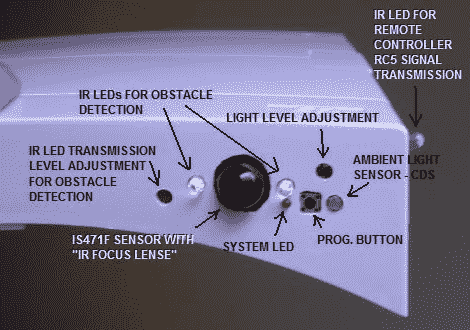

# 运动感应灯模块

> 原文：<https://hackaday.com/2010/05/02/motion-sensing-light-module/>

[Muris]正在推出家庭照明系统。他开发了这个动作感应模块，作为我们上周看到的 T2 红外开关的附件。在他的入口门上有某种保险丝盒，你在上面看到的白色盖子，是他安装红外距离传感器来检测移动和开灯的地方。RC5 红外协议用于传输必要的信号来打开灯，然后当设定的时间过去后，它会再次关闭灯。