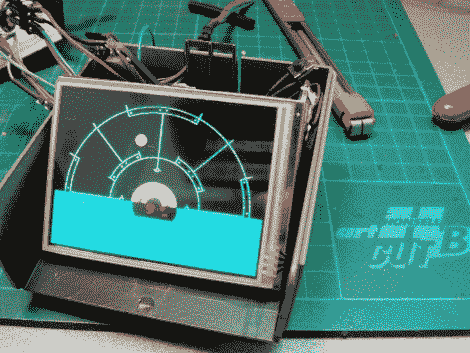

# 外星人电影中的运动追踪道具

> 原文：<https://hackaday.com/2011/02/17/motion-tracking-prop-from-alien-movie/>

[Erv Plecter]喜欢再造实际工作的电影道具。这一次大约是在[左右，他正在用原版外星人](http://www.plecterlabs.com/catalog/article_info.php?articles_id=93&language=en)电影制作动作探测器。在休息后的视频中看到听到这个道具，你会立刻想起它。在我们看来，这部电影最精彩的部分是使用了有节奏的声音来增强观众的紧张感。[Erv 的] build 捕捉到了这种感觉，当一个物体向你移动时，声纳会发出稳定的节拍和不断升高的音调。该设备可以轻松跟踪您自己的运动，因为它包含 GPS 模块和电子罗盘。他提到还有一个运动传感器，但对这部分的工作原理有点模糊。不过，这是一个不错的小作品，尽管还没有完全完成，但看起来很棒。

[https://www.youtube.com/embed/GyCftshYASE?version=3&rel=1&showsearch=0&showinfo=1&iv_load_policy=1&fs=1&hl=en-US&autohide=2&wmode=transparent](https://www.youtube.com/embed/GyCftshYASE?version=3&rel=1&showsearch=0&showinfo=1&iv_load_policy=1&fs=1&hl=en-US&autohide=2&wmode=transparent)