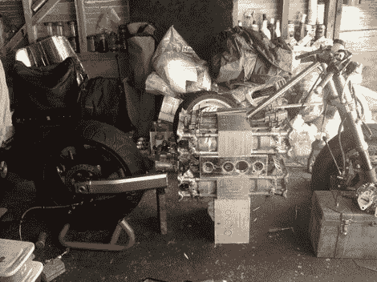

# 摩托车引擎黑客喜欢有一个旧的 F1 在你的腿之间

> 原文：<https://hackaday.com/2012/02/28/motorcycle-engine-hack-like-having-an-old-f1-between-your-legs/>

将一台 16 缸发动机组装成一辆摩托车的难度真的让人难以想象。但这正是安德烈亚斯·乔治迪斯在他的车库里所做的。这是两个直 8 发动机夹在另一个顶部，一个定制的曲轴箱连接它们。听着，那些定制的零件是手工加工的，使用久经考验的技术，而不是现代的计算机辅助。

那么，复杂性从何而来呢？首先，你必须解决结合两个引擎带来的所有问题。听起来这并不是一个新概念，因为老一代的 f1 引擎使用了这项技术。但我们仍然认为，当一个狂热分子接受挑战时，这是硬核的顶峰。然后就是体重的问题。发动机体积庞大，但需要在框架内保持平衡。你还必须想办法让骑手坐在上面(即使是最弓腿的人也不能让他们的臀部绕过这个东西)。

看起来像是从马里奥赛车游戏中出来的东西，应该没有上路的机会。但我们确信(安德烈亚斯)会证明我们是错的。

[感谢三只恶狼]